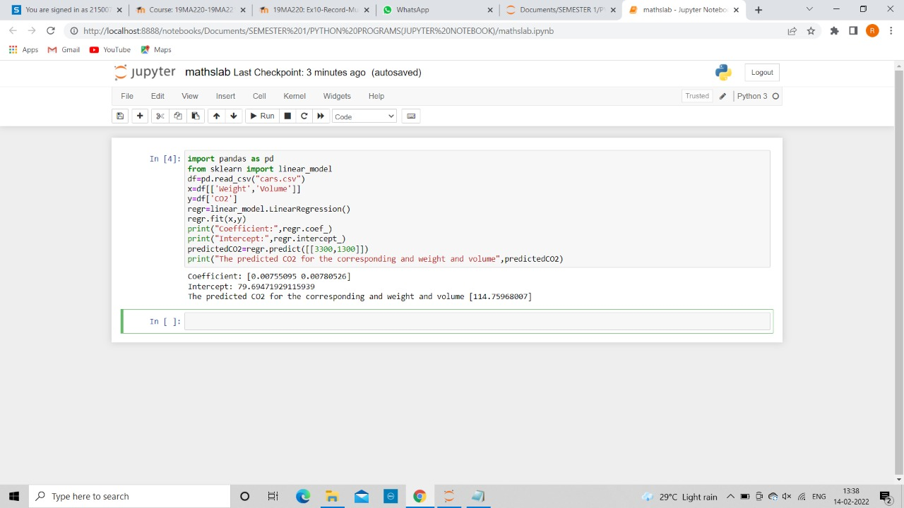

# Implementation of Multivariate Linear Regression
## Aim
To write a python program to implement multivariate linear regression and predict the output.
## Equipment’s required:
1.	Hardware – PCs
2.	Anaconda – Python 3.7 Installation / Moodle-Code Runner
## Algorithm:
### Step1
import pandas as pd
### Step2
from sklearn import linear_model
### Step3
use linear.Regreission to get valus
### Step4
using regr.coef_ and regr.intercept_ to find coefficient and intercept of the data
### Step5
using predict() print output
## Program:
```
import pandas as pd
from sklearn import linear_model
df=pd.read_csv("cars.csv")
x=df[['Weight','Volume']]
y=df['CO2']
regr=linear_model.LinearRegression()
regr.fit(x,y)
print("Coefficient:",regr.coef_)
print("Intercept:",regr.intercept_)
predictedCO2=regr.predict([[3300,1300]])
print("The predicted CO2 for the corresponding and weight and volume",predictedCO2)

```
## Output:

## Result
Thus the multivariate linear regression is implemented and predicted the output using python program.